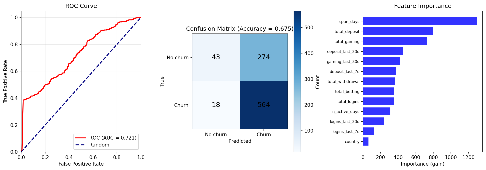

# Take Home Test – User Activity Forecast

This project predicts customer churn using the given dataset. Below are the answers to the assignment questions.

---

## 1. Prediction target and why it matters

The prediction target is **churn**. In this project, churn means that a customer has no activity (no login, no deposit, no betting, no gaming) in the 30 days after a chosen reference date. So we predict: “Will this customer stop being active in the next 30 days?” (yes = churn, no = no churn).

This target is useful because if we know who might churn early, we can try to keep them. For example, the business can send special offers or support to customers who are likely to churn, so they stay and keep playing. It also helps with risk (e.g. which customers might leave and not pay back) and with planning (e.g. how many active customers we will have). So predicting churn helps the company act before the customer is already gone.

---

## 2. Workflow and model choice

The workflow is: first we load the data and fix the date column. Then we pick a reference date (the last date in the data minus 30 days). For each customer we look at their last known date and we define the label: if the customer had any activity in the next 30 days after that date, they are “no churn” (0), and if they had no activity in that window, they are “churn” (1). After that we build features from each customer’s history up to that last date. These features include country, how many days they were active, how long they have been a customer, total deposit and gaming and betting and withdrawal and logins, and also the same kind of numbers but only for the last 7 days and the last 30 days. So we use both long-term and short-term behaviour.

What “last 7 days” and “last 30 days” mean here: for each customer we have a “last date”, which is the last day we see them in the data before we check if they churn. From that date we look backward in time. “Last 7 days” means the 7 days that end on that last date (from 7 days before until that day). In that window we sum things like how much they deposited, how many times they logged in, and how much they gamed. “Last 30 days” is the same idea but for the 30 days that end on that last date. So we get two sets of numbers: one for very recent behaviour (7 days) and one for a bit longer recent behaviour (30 days). This helps the model see if the customer was already slowing down (e.g. less deposit or fewer logins in the last 7 days) before they actually churned.

We split the data by time (earlier 80% for training, later 20% for testing) so we do not use future information when we train. There are other ways to split, for example random split, or splitting by customer so the same customer is never in both train and test, or cross-validation with several folds. For this first attempt we decided to go with the time-based split because it is the easiest to implement and it matches the idea that we are predicting the future from the past. We use LightGBM as the model because it is fast, works well with mixed types (numbers and categories like country), and we can use AUC to compare models. We treat country as a categorical feature and we use early stopping so we do not overfit. After training we check the model with a ROC curve, a confusion matrix, and feature importance, and we save the model and the plots. The figure below shows this evaluation output from the training code.

No extra preprocessing was added in this first version; the main idea was to show a clear pipeline that a stakeholder can follow from raw data to a saved model and evaluation.

---

## 3. Deploying the model in a scalable way with monitoring

To put this model into production, We would run it as a service that other systems can call. The trained LightGBM model can be wrapped in a small API (for example using Flask or FastAPI) that receives customer features and returns a churn probability. This service would be packaged in a Docker container so it runs consistently and can scale easily. The containers can be deployed on a cloud platform such as Google Cloud (or AWS/Azure). Feature generation would follow the same logic as in training to ensure consistency.

For regular execution, such as daily scoring or periodic retraining, a scheduler like Airflow can be used. Airflow manages the workflow steps, loading new data, building features, running predictions, and retraining or redeploying the model when needed.

To ensure reliability, We would add logging and monitoring. This includes logging predictions, model versions, and errors, monitoring input data for drift, and storing trained models with versioning so we can track changes or roll back if necessary.

Overall, this setup supports a scalable, reproducible, and maintainable machine learning workflow.

---

## How to run

Use Python with the packages in `requirements.txt`. Put `dataset.csv` in the same folder as `train_churn_model.py` and run `train_churn_model.py`. The script will create `churn_model.txt` and `churn_evaluation.png`.
